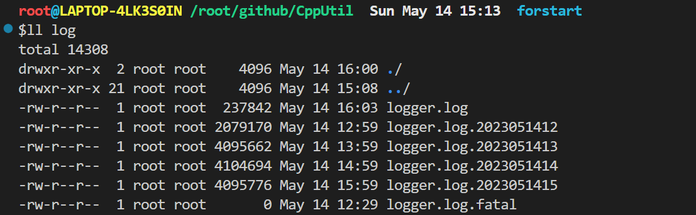
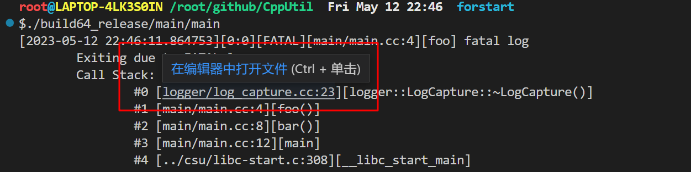

# 日志库

## 简介

线程安全的 C++ 同步日志库。

## 特性

* 默认输出到控制台
* 支持配置日志保存路径和文件
* 每小时自动切割日志
* 支持设置日志最大保存时长，自动清理过期日志
* 支持 DEBUG、INFO、WARN、ERROR 和 FATAL 五种级别日志输出，FATAL 日志触发时打印堆栈并退出程序
* 支持多种日志形式
  * 格式化控制符：`LogInfo("%s is %d years old.", "Lily", 8);`
  * 流式：`LOG_INFO << "Lily is " << 8 << " years old.";`
  * KV 日志：`LogInfoKV("student info").LogKV("name", "lily").LogKV("age", 8);`
* 日志信息丰富，包括时间、线程号、UUID、日志级别、文件、行号、函数名
* 支持断言，断言失败时打印堆栈并退出程序
* 支持信号捕获，捕获到特殊信号时打印堆栈并退出程序
* 支持条件日志
* 支持每 N 次打印一条日志
* 支持打印前 N 条日志

## 具体使用方法

### 1. 环境搭建

具体搭建方法参考 Dockerfile，搭建 docker 环境直接执行脚本即可：

```bash
bash docker.sh
```

### 2. 编译

可以使用 blade 编译：

```bash
# release 模式
$blade build logger/...

# debug 模式
$blade build -pdebug logger/...

# 使用 bear 生成 compile_commands.json 方便调试
$bear -- blade build logger/...
```

也可以使用 xmake：

```bash
# 编译静态库
$xmake -a

# 安装 libcpputil
# 1. 打包安装到 ./pkg 目录
$xmake install -o pkg
# 2. 安装到 /usr/local 目录
$xmake install -o /usr/local
```

### 3. 测试

```bash
$./build64_debug/logger/test/logger_test
```

## 具体描述

### 1. 默认输出到控制台

直接开箱即用，相当于没有任何配置，日志会输出到控制台：

```c++
#include "logger/log.h"

int main() {
  LOG_DEBUG << "debug message";
  LOG_INFO << "double: " << 3.14 << ", int64_t:" << -801;
  LOG_WARN << "warn message";
  LOG_ERROR << "error message";
}
```

输出：

```bash
$./build64_release/main/test
[2023-05-14 14:47:07.318998][18442:0][DEBUG][main/test.cc:8][main] debug message
[2023-05-14 14:47:07.319095][18442:0][INFO][main/test.cc:9][main] double: 3.14, int64_t:-801
[2023-05-14 14:47:07.319111][18442:0][WARN][main/test.cc:10][main] warn message
[2023-05-14 14:47:07.319123][18442:0][ERROR][main/test.cc:11][main] error message
```

### 2. 支持配置日志保存路径和日志文件名

Logger 模块支持配置，示例配置文件在 `logger/test/conf/logger.conf` 中：

```toml
# 日志级别, 默认打印INFO日志
#   * 0: DEBUG
#   * 1: INFO
#   * 2: WARN
#   * 3: ERROR
Level=1
# 日志存储文件夹, 默认输出到当前文件夹
Directory="./log"
# 日志文件名, 默认输出到控制台
FileName="logger.log"
# 保存小时数, 不设置则不会进行日志切割
RetainHours=4
```

> 如果没配置 `Level` 会输出所有级别的日志，没配置 `FileName` 的话会将日志直接输出到控制台，没配置的 `RetainHours` 就不会切割日志。

按照上述的配置，日志会写入到 `./log/logger.log` 文件中，按照每小时进行日志切割，删除超过 4 个小时的历史日志。

### 3. 自动切割日志和清理过期日志

按照 2 中的配置，日志每隔小时会切割成新的日志文件，并且最多保留 4 个小时的日志文件：



### 4. 支持五种日志级别

和大部分日志库一样，Logger 提供了 DEBUG、INFO、 WARN、ERROR 和 FATAL 五种级别的日志，FATAL 日志触发时会打印堆栈并退出程序。

另外打印的堆栈已经解析出文件、函数和行号。例如：

```c++
#include "logger/log.h"

void foo() {
  LOG_FATAL << "fatal log";
}

void bar() {
  foo();
}

int main() {
  bar();
}
```

输出信息如下：

```bash
$./build64_release/main/test
[2023-05-14 14:48:56.478554][19133:0][FATAL][main/test.cc:4][foo] fatal log
        Exiting due to FATAL log
        Call Stack:
                #0 [logger/log_capture.cc:23][logger::LogCapture::~LogCapture()]
                #1 [main/test.cc:4][foo()]
                #2 [main/test.cc:8][bar()]
                #3 [main/test.cc:12][main]
                #4 [../csu/libc-start.c:308][__libc_start_main]
```

在 VSCode、CLion 等主流的 IDE 中可以根据堆栈信息直接跳转到对应的函数地址：



### 5. 支持流式日志、格式化日志和 KV 日志等多种格式

支持类似 printf 的格式化日志：

```c++
LogInfo("info message");
LogDebug("debug message");
LogInfo("name:%s age:%d weight:%.1f", "tomocat", 26, 56.23);
LogWarn("warn message");
LogError("error message");
LogErrorWithTag("err_tag", "error message with tag, type:%s length:%d", "pencil", 17);
```

和主流的日志库一样也支持流式日志：

```c++
LOG_INFO << "double: " << 3.14 << ", int64_t:" << -801;
LOG_WARN << "warn message";
LOG_ERROR << "error message";
```

也支持类似 logrus 的 KV 日志：

```c++
struct Foo {
  int32_t i32 = -10;
  uint64_t ui64 = 1234;
  double db = 3.1415926;
  bool bl = true;
  std::string str = "cat";
  const char* ch = "dog";
};

Foo foo;
LogInfoKV("example_prefix")
  .LogKV("int32_data", foo.i32)
  .LogKV("uint64_data", foo.ui64)
  .LogKV("double_data", foo.db)
  .LogKV("bool_data", foo.bl)
  .LogKV("string_data", foo.str)
  .LogKV("char_data", foo.ch)
  .LogKV("float_format_data=%f", foo.db);
```

上述所有日志的输出结果如下所示：

```bash
$./build64_release/main/test
[2023-05-14 14:49:49.590376][19423:0][INFO][main/test.cc:4][main] info message
[2023-05-14 14:49:49.590439][19423:0][DEBUG][main/test.cc:5][main] debug message
[2023-05-14 14:49:49.590446][19423:0][INFO][main/test.cc:6][main] name:tomocat age:26 weight:56.2
[2023-05-14 14:49:49.590472][19423:0][WARN][main/test.cc:7][main] warn message
[2023-05-14 14:49:49.590489][19423:0][ERROR][main/test.cc:8][main] error message
[2023-05-14 14:49:49.590494][19423:0][ERROR][main/test.cc:9][main][tag=err_tag] error message with tag, type:pencil length:17
[2023-05-14 14:49:49.590505][19423:0][INFO][main/test.cc:11][main] double: 3.14, int64_t:-801
[2023-05-14 14:49:49.590517][19423:0][WARN][main/test.cc:12][main] warn message
[2023-05-14 14:49:49.590520][19423:0][ERROR][main/test.cc:13][main] error message
[2023-05-14 14:49:49.590527][19423:0][INFO][main/test.cc:25][main] example_prefix||int32_data=-10||uint64_data=1234||double_data=3.14159||bool_data=1||string_data=cat||char_data=dog||float_format_data=%f=3.14159
```

### 6. 丰富的日志信息

从前面的例子不难发现，Logger 打印出来的日志有丰富的调试信息，以其中一条 `LogErrorWithTag` 为例：

```bash
[2023-05-14 14:49:49.590494][19423:0][ERROR][main/test.cc:9][main][tag=err_tag] error message with tag, type:pencil length:17
```

* 时间：`2023-05-14 14:49:49.590494`
* 线程号：`19423`，在多线程程序中区分不同线程的日志
* trace id：这里是 0，常用于在 RPC 程序中区分不同 RPC 请求，追踪请求链路，可以通过 `logger::Logger::set_trace_id()` 方法给对应的线程设置 trace id
* 日志级别：`ERROR`，共有五种级别
* 日志所在文件行号：`main/test.cc:9`
* 日志所在函数：`main`
* tag：`tag=err_tag`，特殊字段，用于区分用户自定义的 Tag
* 日志内容：`error message with tag, type:pencil length:17`

### 7. 支持断言

支持类似 gtest 中的各类断言，断言失败时直接打印堆栈并退出程序：

```c++
#include "logger/log.h"

int main() {
  CHECK(false) << "it should be true";
  CHECK_NOTNULL(nullptr) << "it should not be nullptr";
  CHECK_LT(1, 1);
  CHECK_LE(1, 0);
  CHECK_GT(1, 1);
  CHECK_GE(1, 2);
  CHECK_EQ(1, 2);
  CHECK_NE(1, 1);
}
```

可以看到 `CHECK_XX` 宏也提供了流式日志的写法，可以补充一些断言对应的日志信息。正常情况下运行时一旦断言失败程序就会打印堆栈并退出，上述代码的运行结果如下：

```bash
$./build64_release/main/test
[2023-05-14 14:54:35.334929][20033:0][FATAL][main/test.cc:4][main] it should be true
        CHECK(false) fail.
        Exiting due to FATAL log
        Call Stack:
                #0 [logger/log_capture.cc:23][logger::LogCapture::~LogCapture()]
                #1 [main/test.cc:4][main]
                #2 [../csu/libc-start.c:308][__libc_start_main]
```

在 DEBUG 模式下断言失败并不会退出，我们看到所有断言失败的栈：

```bash
$blade build -pdebug main
$./build64_debug/main/test
[2023-05-14 14:57:12.790181][20456:0][FATAL][main/test.cc:4][main] it should be true
        CHECK(false) fail.
        Exiting due to FATAL log
        Call Stack:
                #0 [logger/log_capture.cc:23][logger::LogCapture::~LogCapture()]
                #1 [main/test.cc:4][main]
                #2 [../csu/libc-start.c:308][__libc_start_main]
[2023-05-14 14:57:12.878731][20456:0][FATAL][main/test.cc:5][main] it should not be nullptr
        CHECK(nullptr != nullptr) fail.
        Exiting due to FATAL log
        Call Stack:
                #0 [logger/log_capture.cc:23][logger::LogCapture::~LogCapture()]
                #1 [main/test.cc:5][main]
                #2 [../csu/libc-start.c:308][__libc_start_main]
[2023-05-14 14:57:12.955316][20456:0][FATAL][main/test.cc:6][main] 
        CHECK(1 < 1) fail.
        Exiting due to FATAL log
        Call Stack:
                #0 [logger/log_capture.cc:23][logger::LogCapture::~LogCapture()]
                #1 [main/test.cc:6][main]
                #2 [../csu/libc-start.c:308][__libc_start_main]
[2023-05-14 14:57:13.030313][20456:0][FATAL][main/test.cc:7][main] 
        CHECK(1 <= 0) fail.
        Exiting due to FATAL log
        Call Stack:
                #0 [logger/log_capture.cc:23][logger::LogCapture::~LogCapture()]
                #1 [main/test.cc:7][main]
                #2 [../csu/libc-start.c:308][__libc_start_main]
[2023-05-14 14:57:13.113146][20456:0][FATAL][main/test.cc:8][main] 
        CHECK(1 > 1) fail.
        Exiting due to FATAL log
        Call Stack:
                #0 [logger/log_capture.cc:23][logger::LogCapture::~LogCapture()]
                #1 [main/test.cc:8][main]
                #2 [../csu/libc-start.c:308][__libc_start_main]
[2023-05-14 14:57:13.215617][20456:0][FATAL][main/test.cc:9][main] 
        CHECK(1 >= 2) fail.
        Exiting due to FATAL log
        Call Stack:
                #0 [logger/log_capture.cc:23][logger::LogCapture::~LogCapture()]
                #1 [main/test.cc:9][main]
                #2 [../csu/libc-start.c:308][__libc_start_main]
[2023-05-14 14:57:13.300053][20456:0][FATAL][main/test.cc:10][main] 
        CHECK(1 == 2) fail.
        Exiting due to FATAL log
        Call Stack:
                #0 [logger/log_capture.cc:23][logger::LogCapture::~LogCapture()]
                #1 [main/test.cc:10][main]
                #2 [../csu/libc-start.c:308][__libc_start_main]
[2023-05-14 14:57:13.388282][20456:0][FATAL][main/test.cc:11][main] 
        CHECK(1 != 1) fail.
        Exiting due to FATAL log
        Call Stack:
                #0 [logger/log_capture.cc:23][logger::LogCapture::~LogCapture()]
                #1 [main/test.cc:11][main]
                #2 [../csu/libc-start.c:308][__libc_start_main]
```

### 8. 支持信号捕获

一般情况下开发 C++ 服务很容易触发信号从而导致 coredump，因此我们捕获了常见的信号并打印对应的栈信息：

```c++
void HandleSignal() {
  auto handler = [](int signal) {
    printf("receive signal: %d\n", signal);
    Logger::Instance()->Log(Logger::Level::FATAL_LEVEL, "Exiting due to receive signal: %d", signal);
    exit(0);
  };

  signal(SIGHUP, SIG_IGN);
  signal(SIGQUIT, SIG_IGN);
  signal(SIGPIPE, SIG_IGN);
  signal(SIGTTOU, SIG_IGN);
  signal(SIGTTIN, SIG_IGN);
  signal(SIGCHLD, SIG_IGN);
  signal(SIGTERM, SIG_IGN);

  signal(SIGBUS, handler);   // 10: Bus error (bad memory access)
  signal(SIGSEGV, handler);  // 11: Invalid memory reference
  signal(SIGABRT, handler);  // 6: Abort signal from abort(3)
  signal(SIGILL, handler);   // 4: Illegal Instruction
  signal(SIGFPE, handler);   // 8: Floating point exception
}
```

举个例子：

```c++
#include <signal.h>

#include "logger/log.h"

int main() {
  LOG_INFO << "test crash with signal 8";
  ::raise(8);
}
```

输出结果如下：

```c++
$./build64_release/main/test
[2023-05-14 15:00:32.566447][21122:0][INFO][main/test.cc:6][main] test crash with signal 8
receive signal: 8
[2023-05-14 15:00:32.566505][21122:0][FATAL]Exiting due to receive signal: 8
        Exiting due to FATAL log
        Call Stack:
                #0 [logger/logger.cc:45][operator()]
                #1 [logger/logger.cc:47][_FUN]
                #2 [/build/glibc-SzIz7B/glibc-2.31/signal/../sysdeps/unix/sysv/linux/x86_64/sigaction.c:0][???]
                #3 [../sysdeps/unix/sysv/linux/raise.c:51][raise]
                #4 [main/test.cc:7][main]
                #5 [../csu/libc-start.c:308][__libc_start_main]
```

### 9. 支持条件日志

只有满足条件时才会打印日志：

```c++
#include <signal.h>

#include "logger/log.h"

int main() {
  LOG_DEBUG_IF(1 > 2) << "debug message";
  LOG_INFO_IF(1 < 2) << "info message";
  LOG_WARN_IF(true) << "warn message";
  LOG_ERROR_IF(false) << "error message";
}
```

输出结果：

```bash
$./build64_release/main/test
[2023-05-14 15:04:06.533820][22300:0][INFO][main/test.cc:7][main] info message
[2023-05-14 15:04:06.533896][22300:0][WARN][main/test.cc:8][main] warn message
```

### 10. 支持每 N 次打印一条日志

也是很常见的日志库特性：

```c++
#include <signal.h>

#include "logger/log.h"

int main() {
  for (int i = 0; i < 10000; ++i) {
    LOG_INFO_EVERY(1000) << "info message";
  }
}
```

输出结果：

```bash
$./build64_release/main/test
[2023-05-14 15:06:31.821710][22914:0][INFO][main/test.cc:7][main] info message
[2023-05-14 15:06:31.821794][22914:0][INFO][main/test.cc:7][main] info message
[2023-05-14 15:06:31.821801][22914:0][INFO][main/test.cc:7][main] info message
[2023-05-14 15:06:31.821805][22914:0][INFO][main/test.cc:7][main] info message
[2023-05-14 15:06:31.821821][22914:0][INFO][main/test.cc:7][main] info message
[2023-05-14 15:06:31.821825][22914:0][INFO][main/test.cc:7][main] info message
[2023-05-14 15:06:31.821831][22914:0][INFO][main/test.cc:7][main] info message
[2023-05-14 15:06:31.821836][22914:0][INFO][main/test.cc:7][main] info message
[2023-05-14 15:06:31.821845][22914:0][INFO][main/test.cc:7][main] info message
[2023-05-14 15:06:31.821852][22914:0][INFO][main/test.cc:7][main] info message
```

### 11. 支持打印前 N 条日志

常见的 DEBUG 方法，只打印前 N 条日志：

```bash
#include <signal.h>

#include "logger/log.h"

int main() {
  for (int i = 0; i < 10000; ++i) {
    LOG_INFO_FIRST_N(5) << "info message";
  }
}
```

输出结果：

```bash
$./build64_release/main/test
[2023-05-14 15:08:27.422138][23554:0][INFO][main/test.cc:7][main] info message
[2023-05-14 15:08:27.422197][23554:0][INFO][main/test.cc:7][main] info message
[2023-05-14 15:08:27.422206][23554:0][INFO][main/test.cc:7][main] info message
[2023-05-14 15:08:27.422225][23554:0][INFO][main/test.cc:7][main] info message
[2023-05-14 15:08:27.422230][23554:0][INFO][main/test.cc:7][main] info message
```

## 使用方法

### 1. 安装

目前使用的是 xmake，安装方法如下：

```bash
# 编译所有目标
$xmake -a

# 安装到 /usr/local
$xmake install -o /usr/local
```

另外打印堆栈依赖第三方库 libbacktrace，安装方法如下：

```bash
git clone https://github.com/ianlancetaylor/libbacktrace.git
cd libbacktrace
./configure
make -j8
sudo make install
```

还需要依赖第三方库 libuuid，可自行安装。

### 2. 用法

如果不需要保存日志文件，直接开箱即用，日志会输出到控制台，断言失败或者触发信号时会打印堆栈并退出程序：

```c++
#include <signal.h>

#include "logger/log.h"

int main() {
  LOG_INFO << "info message";
  LOG_ERROR << "error message";

  ::raise(8);
}
```

编译：

```bash
g++ -g main.cc -o main -I/usr/local/include/cpputil -lcpputil -lbacktrace -luuid
```

运行：

```bash
$./main 
[2023-05-14 20:30:26.443901][7608:0][INFO][main.cc:6][main] info message
[2023-05-14 20:30:26.444008][7608:0][ERROR][main.cc:7][main] error message
receive signal: 8
[2023-05-14 20:30:26.444026][7608:0][FATAL]Exiting due to receive signal: 8
        Exiting due to FATAL log
        Call Stack:
                #0 [/build/glibc-SzIz7B/glibc-2.31/signal/../sysdeps/unix/sysv/linux/x86_64/sigaction.c:0][???]
                #1 [../sysdeps/unix/sysv/linux/raise.c:51][__GI_raise]
                #2 [/root/github/CppUtil/main/main.cc:9][main]
                #3 [../csu/libc-start.c:308][__libc_start_main]
```

如果是在项目中使用的话，一般需要将日志输出到指定的文件夹，需要先创建一个配置文件 `logger.conf`：

```toml
# 日志级别, 默认打印INFO日志
#   * 0: DEBUG
#   * 1: INFO
#   * 2: WARN
#   * 3: ERROR
Level=1
# 日志存储文件夹, 默认输出到当前文件夹
Directory="./log"
# 日志文件名, 默认输出到控制台
FileName="logger.log"
# 保存小时数, 不设置则不会进行日志切割
RetainHours=4
```

在代码中可以基于配置初始化 Logger：

```c++
#include "logger/log.h"

int main() {
  if (!logger::Logger::Instance()->Init("./logger.conf")) {
    LOG_ERROR << "Init logger fail, print to console";
  }

  logger::Logger::set_trace_id();
  LOG_INFO << "Init logger successfully!";
}
```

编译后运行，日志会存储在 `./log` 文件夹中：

```bash
$g++ -g main.cc -o main -I/usr/local/include/cpputil -lcpputil -lbacktrace -luuid
$./main
```

## 后续功能支持

作为个人开发者而言，我觉得这个库提供的功能已经基本满足使用。但为了满足公司级别日志库的需求，后续开发方向包括：

* 当前是同步日志库，后续提供配置项支持异步写入日志
* 提供性能测试，和 google glog 等进行对比
* 支持自定义日志格式
* 支持不同 topic 打印到不同日志文件中
